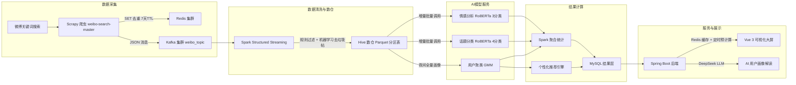
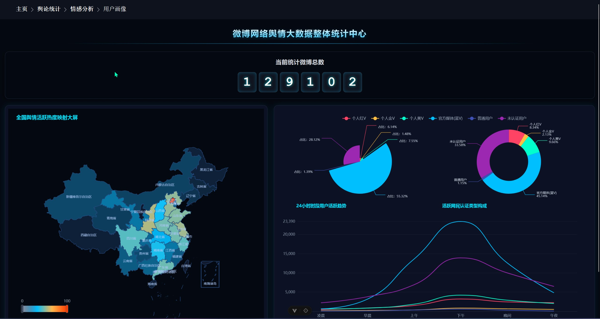
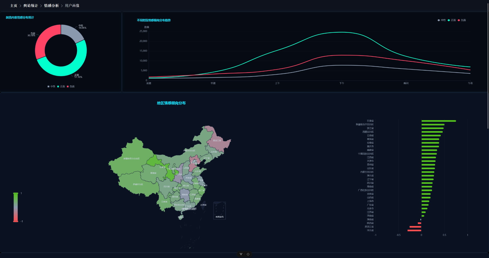
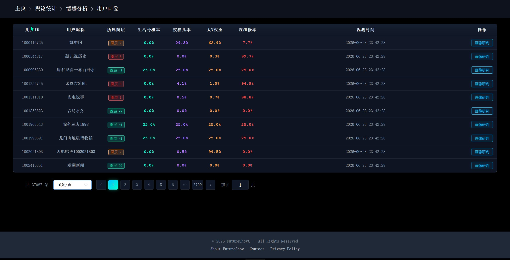
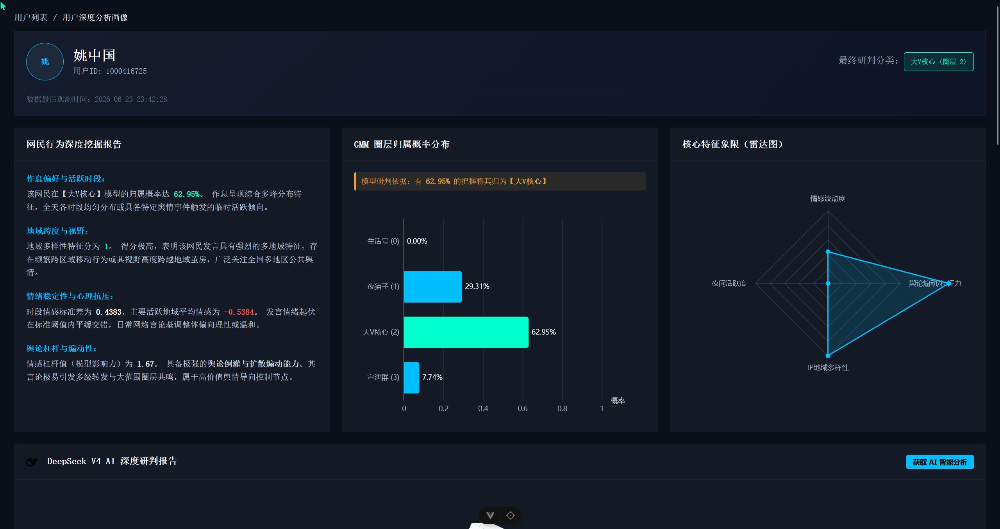
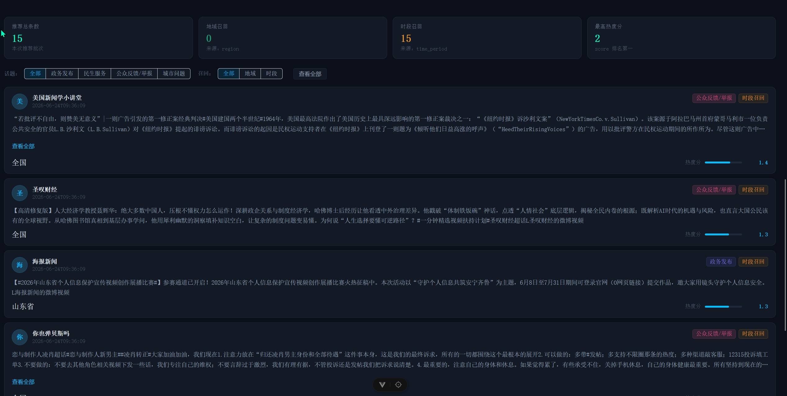

# 微博政务民生舆情分析系统

> 基于大数据与多模型协同的政务舆情分析平台，对微博政务/民生相关文本进行情感分析、话题分类、用户圈层聚类与个性化内容推荐，并通过可视化大屏呈现宏观舆情态势。

## 系统架构



**数据链路**：微博关键词搜索 → Scrapy 爬虫 → Redis 集群去重（7 天 TTL）→ Kafka → Spark Structured Streaming 清洗（规则 + 结巴分词 + TF-IDF + 逻辑回归过滤垃圾帖）→ Hive 数仓多维分区 → 三个 FastAPI 模型服务增量打标 → Spark 聚合统计 / 用户画像 / 个性化推荐 → MySQL → Spring Boot（Redis 缓存 + 定时预计算）→ Vue 3 大屏。

## 相关页面











## 技术栈

| 层次 | 技术 |
|---|---|
| 数据采集 | Scrapy（`weibo-search-master`，按政务民生关键词搜索微博）→ Redis 集群去重 → Kafka |
| 流式处理 | Apache Spark 3.5（Scala 2.12）Structured Streaming |
| 存储 | Hive 3.1（Parquet 分区表）+ MySQL 8.0 + Redis 6.2 |
| 模型服务 | FastAPI + PyTorch（三个独立服务，见下） |
| 后端 | Spring Boot 2.7 + MyBatis + Druid + PageHelper + Jedis |
| 前端 | Vue 3 + Vite + ECharts 6 + Element Plus + Pinia |
| 大模型 | DeepSeek API（用户画像解读） |

## AI 模型服务（`roberta/FasterApi/`）

| 端口 | 服务文件 | 模型 | 任务 |
|---|---|---|---|
| 8000 | `reberta_sen.py` | `weibo-sentiment-3class` | 情感 3 分类（正面/中性/负面）+ 连续情感得分 |
| 8001 | `getLabelService.py` | `final_weibo_model` | 话题 4 分类（政务发布/城市问题/民生服务/公众反馈举报） |
| 8002 | `gmm_service.py` | `gmm_cluster_model.pkl` | 用户圈层聚类（GMM，5 类圈层） |

三个服务通过 HTTP 接口被 Spark 侧批量调用（`CallBatchApi.scala`），实现 Scala/Python 异构模型协同。

## 核心功能模块

### 1. 数据清洗与垃圾帖过滤（`weiboData/`）

- 字段精简、互动计数类型转换、按微博 `id` 去重
- 规则清洗：去除 `@用户`、过滤广告/明星相关噪声关键词
- 机器学习过滤：规则特征 + 结巴分词 + TF-IDF + 逻辑回归，训练「垃圾帖/有效帖」二分类器（`WeiboFinalPipeline.scala`）

### 2. 多维分类与情感打标（`Classify.scala`）

- 按发布时间维度：小时（0-23）+ 时段（凌晨/早晨/上午/下午/晚间/午夜）
- 增量话题分类与增量情感分析（left-anti 连接避免重复计算）
- 情感分析输出：标签、标签 ID、连续情感得分（-1 负面 ~ 1 正面）、置信度

### 3. 用户圈层画像（`UserPortrait.scala`）

从情感预测表聚合出 5 个用户行为特征：

| 特征 | 含义 |
|---|---|
| `hourly_sentiment_stddev` | 跨小时情感波动度 |
| `night_post_ratio` | 夜间发帖占比 |
| `region_diversity_score` | 地域关注多样性 |
| `top_region_avg_score` | 最关注地域的平均情感 |
| `sentiment_leverage` | 情绪杠杆率（负面/正面篇均互动比） |

按特征将用户分流为三类后处理：官媒（cluster 99）、沉默用户（cluster -1）、活跃网民（调用 GMM 聚类为 0-3 四类圈层）。

### 4. 个性化推荐（`Recommend.scala`）

- 热度分：`log1p(0.5×转发 + 0.2×评论 + 0.1×点赞)` 对数平滑 + MinMax 归一化
- 综合分：`0.6×热度 + 0.4×情感得分`
- 多路召回：地域偏好 + 时段偏好
- GMM 软概率个性化加权，Top 15 推荐
- 双缓冲表写入（v1↔v2 热切换 + 事务内视图切换），保证零停机

### 5. 后端服务与缓存（`PeoplePoll/`）

- 9 项大屏指标（情感分布、时段情感、地区热度、互动情感、舆情趋势等）
- `@Scheduled` 每 5 分钟预计算 + Redis 缓存，降低数据库压力
- DeepSeek 大模型生成用户画像解读（核心人设/行为分析/运营建议）

### 6. 可视化大屏（`PeoplePoll/my-frontend/`）

- 地图热力、饼图、折线图、桑基图、雷达图等 ECharts 图表
- 舆情总览、情感分析、用户画像、个性化推荐等多个视图

## 项目结构

```
publicSentiment/
├── weibo-search-master/ # Scrapy 爬虫（微博关键词搜索 → Redis 去重 → Kafka）
├── weiboData/          # Spark 数据清洗 + 统计 + 画像 + 推荐（Scala）
├── roberta/            # 三个 FastAPI 模型服务 + 模型文件（Python）
│   └── FasterApi/      #   情感 / 话题 / GMM 服务
└── PeoplePoll/         # Spring Boot 后端 + Vue 3 前端
    └── my-frontend/    #   可视化大屏
```

## 环境要求

- JDK 1.8（Spark 侧）/ JDK 8（后端）
- Scala 2.12 + Spark 3.5 + Hadoop 3.3
- Kafka、Hive、MySQL 8.0、Redis（三台虚拟机一主两从集群）
- Python 3.10 + PyTorch + FastAPI
- Node.js 20+（前端）

> 注：数据库/集群连接信息已硬编码在源码中（如 `Config.scala`、`application.yml`），部署前需按实际环境修改。

## 说明

- 本项目为**流批结合**架构：Scrapy 爬取 + Spark Structured Streaming 流式清洗（准实时），统计/画像/推荐采用定时批处理；数据源（微博公开搜索）本身限制了强实时性。
- 核心目标不是预测单一事件，而是刻画**整体群体情绪、负面浓度、热度波动与关注热点**，为政务决策提供宏观参考。
